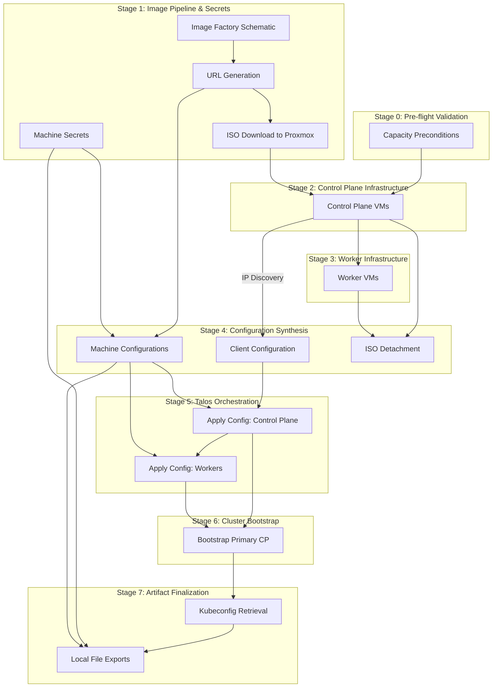

# Enterprise Talos on Proxmox Automation

This repository provides a production-grade Terraform-based framework for the automated deployment and lifecycle management of Talos Linux clusters on Proxmox Virtual Environment (VE). The solution is designed with enterprise requirements in mind, focusing on resource efficiency, predictable placement, and a fully automated "zero-touch" bootstrapping process.

## Architecture and Execution Lifecycle

This solution implements a strictly ordered dependency graph to ensure atomicity and reliability during the deployment of a Talos Linux cluster. The execution is divided into discrete stages, where each stage serves as a quality gate for the subsequent operations.

### Resource Dependency Graph

The following diagram illustrates the authoritative flow of information and execution order enforced by Terraform's directed acyclic graph (DAG).



### Detailed Execution Flow

#### 1. Pre-flight Validation (Stage 0)
The system performs deterministic resource accounting. Before any cloud-init or VM resource is touched, `terraform_data.capacity_assertions` validates that the aggregate vCPU and Memory requested across all node roles does not exceed the physical boundaries of the `pve_capacity` map. This prevents "half-baked" clusters that fail due to late-stage scheduling errors.

#### 2. Artifact Preparation (Stage 1)
- **Secrets Generation**: Unique cluster-wide secrets are generated out-of-band.
- **Dynamic Image Building**: A schematic is submitted to the Talos Image Factory. The resulting ISO, containing the required extensions (e.g., Guest Agent), is pulled directly from the factory and distributed across the target Proxmox nodes' `local` storage.

#### 3. Proxmox Infrastructure Provisioning (Stages 2-3)
- **Control Plane First**: Control plane nodes are provisioned in parallel across the hosts. The provider waits for the Proxmox Guest Agent to report a valid IPv4 address.
- **Sequential Worker Provisioning**: Worker nodes are provisioned only after the control plane resources are successfully created. This ensures the underlying storage and network definitions are stable.

#### 4. Post-Provisioning & Configuration Synthesis (Stage 4)
- **ISO Detachment**: Once a VM's IP is detected, a `local-exec` provisioner triggers a REST API call to Proxmox to set `ide2=none`, cleaning up the boot environment.
- **Configuration Rendering**: Using the discovered IPs, the system renders the `talosconfig` (client access) and machine configurations (node-level logic). The first control plane's IP is injected as the authoritative cluster endpoint.

#### 5. Talos Lifecycle Management (Stages 5-6)
- **Config Application**: Machine configurations are applied to the nodes via the Talos API. The system enforces that the control plane is configured before workers attempt to join.
- **Bootstrap**: A bootstrap signal is sent to the primary control plane node. This initiates etcd cluster formation and Kubernetes control plane initialization.

#### 6. Finalization (Stage 7)
- **Credential Export**: The system waits for the control plane to reach a healthy state, retrieves the administrative `kubeconfig`, and flushes all secrets, machine configs, and access credentials to the `./talos/` directory.

## Implementation Details

### Capacity-Aware Scheduling

The worker placement logic employs an interleaving algorithm to maximize cluster resilience and balance resource utilization:

1.  **Pre-calculation**: The system calculates the aggregate vCPU and Memory requirements for control plane nodes on a per-host basis.
2.  **Slot Allocation**: It determines the number of available "slots" for worker nodes on each physical host by dividing the residual capacity by the worker sizing profile.
3.  **Interleaved Distribution**: Available slots are sorted and interleaved (e.g., Host A - Slot 0, Host B - Slot 0, Host C - Slot 0, Host A - Slot 1...).
4.  **Dynamic Assignment**: Worker nodes are assigned to these interleaved slots sequentially. This ensures that workers are spread as widely as possible across the physical infrastructure, even if some nodes have significantly more capacity than others.

### Automated ISO Detachment

To maintain a clean boot environment and prevent unintended re-installations, the solution automates the removal of the Talos installation media:

- **Mechanism**: A `terraform_data` resource monitors the state of all VM instances.
- **Dependency**: The process is triggered only after the Proxmox provider successfully reports the VM's dynamic IP address, which serves as a proxy for the Guest Agent's readiness.
- **Action**: A `PUT` request is dispatched to the Proxmox API to set the `ide2` CD-ROM drive to `none`.
- **Persistence**: The VM resources use `lifecycle { ignore_changes = [disk] }` to ensure that subsequent Terraform operations do not attempt to revert the ISO detachment.

## Configuration Variables

The following variables are defined in `config.tf` and `providers.tf` to govern the behavior and sizing of the infrastructure.

### Provider Authentication

These variables are required for authenticating with the Proxmox API. It is recommended to provide these via a `.tfvars` file or environment variables.

| Variable | Type | Sensitive | Description |
| :--- | :--- | :--- | :--- |
| `proxmox_api_url` | `string` | No | The full URL of the Proxmox API (e.g., `https://pve.example.com:8006/api2/json`). |
| `proxmox_api_token_id` | `string` | Yes | Proxmox API Token ID (e.g., `terraform@pam!mytoken`). |
| `proxmox_api_token_secret` | `string` | Yes | Proxmox API Token Secret. |

### Global Cluster Configuration

| Variable | Type | Default | Description | Constraints / Validation |
| :--- | :--- | :--- | :--- | :--- |
| `cluster_name` | `string` | - | Logical identifier for the cluster. Affects VM names, Talos cluster name, and tags. | Min 3 chars, lowercase, numbers, and hyphens only. |
| `environment` | `string` | `"lab"` | Logical stage of the deployment. | Must be one of: `dev`, `lab`, `prod`. |
| `ha_enabled` | `bool` | `true` | Enables High Availability constraints for the control plane. | - |

### Scaling and Resource Allocation

| Variable | Type | Default | Description | Constraints / Validation |
| :--- | :--- | :--- | :--- | :--- |
| `control_plane_count` | `number` | `3` | Number of control plane nodes (etcd members). | If `ha_enabled=true`: must be odd and $\ge 3$. Else $\ge 1$. Max 7. |
| `worker_count` | `number` | `2` | Number of worker nodes to provision. | Must be $\ge 0$. |
| `sizing` | `object` | *See below* | Resource profiles for each node role. | - |

**Sizing Default Profile:**
```hcl
sizing = {
  control_plane = { vcpu = 2, memory = 4096, disk = 40 }
  worker        = { vcpu = 2, memory = 4096, disk = 40 }
}
```

**Sizing Constraints:**
- **Control Plane**: Minimum 2 vCPU, 2048MB RAM, 20GB disk.
- **Worker**: Minimum 1 vCPU, 1024MB RAM, 20GB disk.

### Proxmox Infrastructure (`proxmox` object)

| Attribute | Type | Default | Description |
| :--- | :--- | :--- | :--- |
| `endpoint` | `string` | - | The base URL of the Proxmox cluster (e.g., `https://192.168.1.10:8006`). |
| `insecure` | `bool` | `false` | Disable TLS certificate verification. |
| `target_nodes` | `list(string)` | - | List of physical Proxmox nodes available for VM placement. |
| `datastore_id` | `string` | - | Identifier of the Proxmox storage where VM disks will be created. |
| `bridge` | `string` | - | Name of the Linux Bridge on Proxmox for VM networking (e.g., `vmbr0`). |
| `vlan_id` | `number` | `null` | Optional VLAN tag to apply to the VM network interfaces. |

### Placement and Scheduling

| Variable | Type | Default | Description | Constraints / Validation |
| :--- | :--- | :--- | :--- | :--- |
| `placement` | `object` | *See below* | Defines the scheduling strategy and manual overrides. | `strategy` must be: `round_robin`, `spread`, or `pin`. |
| `pve_capacity` | `map(object)` | - | Authoritative map of physical host resources (vCPU and Memory in MB). | Must not be empty. |

**Placement Defaults:**
```hcl
placement = {
  strategy = "spread"
  pinned   = {}
}
```

**Pinned Placement Example:**

When using the `pin` strategy, explicitly map Proxmox node names to lists of VM names to force placement:

```hcl
placement = {
  strategy = "pin"
  pinned   = {
    pve-node1 = ["talos-lab-cp-01", "talos-lab-wk-01"]
    pve-node2 = ["talos-lab-cp-02"]
    pve-node3 = ["talos-lab-cp-03", "talos-lab-wk-02"]
  }
}
```

- Keys are Proxmox node names from `proxmox.target_nodes`.
- Values are VM names as generated by the module (e.g., `<cluster>-cp-01`, `<cluster>-wk-01`).

**Placement Strategies:**
- `spread`: Automatically distributes nodes to maximize host diversity.
- `round_robin`: Cycles through available hosts sequentially.
- `pin`: Respects explicit VM-to-Host mappings defined in the `pinned` map.

### Talos Configuration (`talos` object)

| Attribute         | Type           | Default  | Description                                                                                                                                  |
|:------------------|:---------------|:---------|:---------------------------------------------------------------------------------------------------------------------------------------------|
| `version`         | `string`       | `v1.9.4` | Talos version used by the Talos Image Factory to build the installer ISO and OCI image.                                                      |
| `arch`            | `string`       | `amd64`  | Target architecture.                                                                                                                         |
| `platform`        | `string`       | `metal`  | Target platform for the image factory.                                                                                                       |
| `extensions`       | `list(string)` | `[]`     | Talos system extensions baked into the image (e.g., `siderolabs/qemu-guest-agent`, `siderolabs/iscsi-tools`, `siderolabs/util-linux-tools`). |
| `extra_manifests`  | `list(string)` | `[]`     | List of remote Kubernetes manifests to apply automatically after bootstrap (e.g., Metallb, cert-manager, ingress-nginx, Longhorn).           |
| `machine`          | `any`          | `{}`     | Arbitrary Talos machine configuration patches to apply (merged with defaults).                                                               |

## Operational Guide

### 1. Preparation

No manual ISO upload required. A Talos Image Factory schematic is generated from the configured `talos.extensions`, and the resulting ISO is automatically uploaded to each Proxmox node's `local` storage.

- Ensure the Proxmox Guest Agent is available inside the VM by including `siderolabs/qemu-guest-agent` in `talos.extensions`.
- Ensure Proxmox nodes expose a `local` ISO-capable storage (or adjust storage settings in code to match your environment).

### 2. Authentication

Configure provider credentials in `dynamic/credentials.auto.tfvars`:

```hcl
proxmox_api_url          = "https://<pve-host>:8006/api2/json"
proxmox_api_token_id     = "terraform-user@pam!tokenid"
proxmox_api_token_secret = "uuid-secret"
```

### 3. Deployment

Initialize the Terraform environment and execute the orchestrated deployment:

```bash
cd dynamic/
terraform init
terraform apply
```

**What to expect during `apply`:**
1.  **Validation**: Terraform evaluates `capacity_assertions`. If resources are insufficient, the process terminates immediately.
2.  **Concurrency**: Image preparation and VM provisioning will begin. Control plane nodes start first.
3.  **Wait State**: Terraform will appear to "hang" while waiting for VM guest agents to report IP addresses. This is expected behavior as the system bridges the gap between infrastructure and configuration layers.
4.  **Orchestration**: Once IPs are discovered, you will see `local-exec` (ISO detachment) and `talos_machine_configuration_apply` resources executing in the correct sequence.
5.  **Bootstrap**: The cluster will initialize. This may take 2-5 minutes depending on your hardware and network speed.

### 4. Cluster Access

Upon completion, all necessary access artifacts are stored in the `./talos/` directory:

- `talosconfig`: Client configuration for `talosctl`.
- `kubeconfig`: Standard Kubernetes configuration for `kubectl`.
- `control-plane.yaml` / `worker.yaml`: Generated machine configurations.
- `secrets.yaml`: Cluster secrets bundle.

## Production Hardening Roadmap

While this solution provides a robust foundation, the following enhancements are recommended for enterprise production environments:

1.  **Remote State Management**: Migrate to a secure remote backend (e.g., S3 with DynamoDB, Terraform Cloud) to ensure state durability and support multi-user workflows.
2.  **Centralized Secret Storage**: Integrate with an enterprise secret manager (e.g., HashiCorp Vault) to remove sensitive credentials from local files.
3.  **Static IP and Load Balancing**: Implement static IP addressing for control plane nodes or deploy a Virtual IP (VIP) solution to ensure a stable and resilient API server endpoint.
4.  **Network Hardening**: Apply granular firewall rules at the Proxmox host level and implement Kubernetes Network Policies to restrict traffic to the management and API ports.
5.  **Observability Integration**: Export Talos and Kubernetes logs/metrics to an enterprise monitoring stack (e.g., ELK, Prometheus/Grafana) for proactive incident management.
6.  **CI/CD Pipeline**: Implement a fully automated deployment pipeline with integrated linting, security scanning, and manual approval gates for production changes.
7.  **Disaster Recovery**: Establish a backup policy using Proxmox Backup Server and implement automated etcd snapshotting.


## Add-ons and Image Pipeline

### Talos Image Factory Integration
- A schematic is generated from `talos.extensions` and submitted to the Talos Image Factory.
- The produced ISO is uploaded automatically to each target Proxmox node.
- Machine configurations set `machine.install.image` to the matching installer image URL, ensuring nodes install the exact image built by the schematic.

### Kubernetes Add-ons Installation
- Inline manifests from `dynamic/cluster-manifests/*.yaml` are embedded into the control plane machine configuration and applied during bootstrap:
  - `metallb-config.yaml`
  - `cert-manager-config.yaml`
  - `nginx-ingress-config.yaml`
  - `longhorn-namespace.yaml`
- Remote YAMLs in `talos.extra_manifests` are fetched and applied automatically by Talos post‑bootstrap. The default example includes Metallb, cert-manager, ingress-nginx, and Longhorn.

### Longhorn Support
- `kubelet.extraMounts` preconfigures `/var/lib/longhorn` on all nodes to support Longhorn volume operations.

## Load Balancing Architecture

The cluster provides three strategies for ensuring high availability of the Kubernetes and Talos APIs. The load balancer is the authoritative endpoint for the cluster (`https://<vip>:6443`).

### 1. Dedicated HAProxy (Strategy: `haproxy`)

This is the recommended approach for production-grade on-premise deployments. Terraform provisions a dedicated set of lightweight Alpine Linux VMs that run HAProxy and Keepalived.

- **High Availability**: Keepalived manages a Virtual IP (VIP) across multiple load balancer nodes.
- **Protocol**: Operates in **TCP mode** to allow the Kubernetes API server to handle TLS termination and mutual TLS authentication (mTLS).
- **Automation**: Backends are automatically updated whenever control plane nodes are added or removed.
- **Ports**:
    - `6443`: Kubernetes API
    - `50000`: Talos API

### 2. Talos Native VIP (Strategy: `talos_native`)

A simpler approach where Talos nodes themselves manage a shared VIP using a built-in VRRP implementation. This eliminates the need for extra VMs but requires all control plane nodes to be on the same Layer 2 network segment.

### 3. External Load Balancer (Strategy: `external`)

If you are using a cloud provider's load balancer or a pre-existing hardware appliance (F5, NetScaler, etc.), use this strategy.

- **Configuration**: You must manually configure your external load balancer to listen on TCP port `6443` and direct traffic to the control plane nodes.
- **Note**: Ensure the load balancer is configured for **Layer 4 (TCP) balancing**. Do not use an HTTP/HTTPS (Layer 7) load balancer, as it will interfere with Kubernetes' mTLS.

## Troubleshooting & Tips

### SSH Host Key Mismatch
When iterating on the cluster, you might encounter a "REMOTE HOST IDENTIFICATION HAS CHANGED" error when trying to SSH into the Load Balancer nodes. This happens because the VM has been recreated with a new SSH host key, but your local `known_hosts` file still contains the old one.

**Manual Fix:**
Run the following command to clear the offending entry (replace with your IP):
```bash
ssh-keygen -R 192.168.88.201
```

**Automated Solution:**
The project includes an automated `ssh_key_cleanup` resource in Terraform that runs `ssh-keygen -R` for each managed node during the provisioning process.

**Pro-Tip (Developer Experience):**
To avoid this issue entirely for your lab network, add the following to your `~/.ssh/config` file:
```ssh
Host 192.168.88.*
    StrictHostKeyChecking no
    UserKnownHostsFile /dev/null
    LogLevel ERROR
```

### Accessing the Load Balancer
The Load Balancer VMs are based on Alpine Linux and are configured with an `alpine` user via Cloud-Init.

```bash
ssh alpine@<load-balancer-ip>
```

---

## Requirements
- Terraform >= 1.14.5
- Providers:
  - telmate/proxmox `3.0.2-rc07`
  - siderolabs/talos `0.10.1`
  - hashicorp/local `2.5.2`
