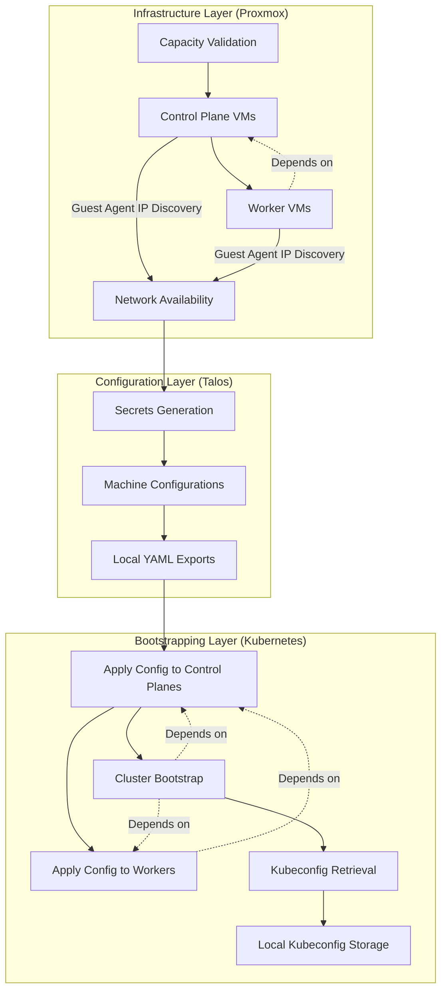

# Enterprise Talos on Proxmox Automation

This repository provides a production-grade Terraform-based framework for the automated deployment and lifecycle management of Talos Linux clusters on Proxmox Virtual Environment (VE). The solution is designed with enterprise requirements in mind, focusing on resource efficiency, predictable placement, and a fully automated "zero-touch" bootstrapping process.

## Architecture and Logic Flow

The deployment architecture is built upon a deterministic dependency chain, ensuring that infrastructure is validated, provisioned, and configured in a logical sequence.

### Deployment Stages

1.  **Capacity Validation**: Before any resource creation occurs, the system evaluates the requested cluster sizing against the available physical capacity defined in `pve_capacity`. This prevents partial deployments that would later fail due to resource exhaustion.
2.  **Infrastructure Provisioning**:
    - **Control Plane Nodes**: Provisioned first to establish the cluster quorum. These nodes are distributed according to the selected placement strategy.
    - **Worker Nodes**: Dynamically assigned to Proxmox nodes based on remaining vCPU and Memory budget after control plane allocation.
3.  **Dynamic Network Discovery**: The solution utilizes the Proxmox Guest Agent to retrieve dynamic IPv4 addresses assigned via DHCP. This eliminates the need for manual IP management while providing the necessary endpoints for Talos configuration.
4.  **Talos Configuration Lifecycle**:
    - **Secrets Management**: Generates unique cluster-wide secrets.
    - **Machine Configuration**: Produces role-specific (controlplane/worker) configurations, dynamically injecting the discovery-derived IP of the primary control plane as the cluster endpoint.
5.  **Cluster Bootstrapping**:
    - Configuration is applied to control plane nodes.
    - Configuration is applied to worker nodes (dependent on control plane readiness).
    - The cluster is initialized (bootstrapped) via the primary control plane node.
6.  **Credential Management**: Upon successful deployment, the `talosconfig` and Kubernetes `kubeconfig` are retrieved and stored locally for administrative use.

### Node Identity and Addressing

To ensure a predictable and manageable infrastructure, each virtual machine is assigned a deterministic VMID based on its role:
- **Control Plane Nodes**: These are assigned VMIDs starting from 401.
- **Worker Nodes**: These are assigned VMIDs starting from 501.

The system relies on the Proxmox Guest Agent being active within the guest operating system. This agent is the primary source of truth for the VM's network identity, allowing Terraform to wait for network availability and retrieve the IP addresses necessary for cluster configuration.

### Resource Dependency Graph

The following diagram illustrates the relationship between the various components and the flow of information from the infrastructure layer to the Kubernetes control plane.



## Implementation Details

### Capacity-Aware Scheduling

The worker placement logic employs an interleaving algorithm to maximize cluster resilience and balance resource utilization:

1.  **Pre-calculation**: The system calculates the aggregate vCPU and Memory requirements for control plane nodes on a per-host basis.
2.  **Slot Allocation**: It determines the number of available "slots" for worker nodes on each physical host by dividing the residual capacity by the worker sizing profile.
3.  **Interleaved Distribution**: Available slots are sorted and interleaved (e.g., Host A - Slot 0, Host B - Slot 0, Host C - Slot 0, Host A - Slot 1...).
4.  **Dynamic Assignment**: Worker nodes are assigned to these interleaved slots sequentially. This ensures that workers are spread as widely as possible across the physical infrastructure, even if some nodes have significantly more capacity than others.

### Automated ISO Detachment

To maintain a clean boot environment and prevent unintended re-installations, the solution automates the removal of the Talos installation media:

- **Mechanism**: A `terraform_data` resource monitors the state of all VM instances.
- **Dependency**: The process is triggered only after the Proxmox provider successfully reports the VM's dynamic IP address, which serves as a proxy for the Guest Agent's readiness.
- **Action**: A `PUT` request is dispatched to the Proxmox API to set the `ide2` CD-ROM drive to `none`.
- **Persistence**: The VM resources use `lifecycle { ignore_changes = [disk] }` to ensure that subsequent Terraform operations do not attempt to revert the ISO detachment.

## Configuration Variables

The following variables are defined in `config.tf` and `providers.tf` to govern the behavior and sizing of the infrastructure.

### Provider Authentication

These variables are required for authenticating with the Proxmox API. It is recommended to provide these via a `.tfvars` file or environment variables.

| Variable | Type | Sensitive | Description |
| :--- | :--- | :--- | :--- |
| `proxmox_api_url` | `string` | No | The full URL of the Proxmox API (e.g., `https://pve.example.com:8006/api2/json`). |
| `proxmox_api_token_id` | `string` | Yes | Proxmox API Token ID (e.g., `terraform@pam!mytoken`). |
| `proxmox_api_token_secret` | `string` | Yes | Proxmox API Token Secret. |

### Global Cluster Configuration

| Variable | Type | Default | Description | Constraints / Validation |
| :--- | :--- | :--- | :--- | :--- |
| `cluster_name` | `string` | - | Logical identifier for the cluster. Affects VM names, Talos cluster name, and tags. | Min 3 chars, lowercase, numbers, and hyphens only. |
| `environment` | `string` | `"lab"` | Logical stage of the deployment. | Must be one of: `dev`, `lab`, `prod`. |
| `ha_enabled` | `bool` | `true` | Enables High Availability constraints for the control plane. | - |

### Scaling and Resource Allocation

| Variable | Type | Default | Description | Constraints / Validation |
| :--- | :--- | :--- | :--- | :--- |
| `control_plane_count` | `number` | `3` | Number of control plane nodes (etcd members). | If `ha_enabled=true`: must be odd and $\ge 3$. Else $\ge 1$. Max 7. |
| `worker_count` | `number` | `2` | Number of worker nodes to provision. | Must be $\ge 0$. |
| `sizing` | `object` | *See below* | Resource profiles for each node role. | - |

**Sizing Default Profile:**
```hcl
sizing = {
  control_plane = { vcpu = 2, memory = 4096, disk = 40 }
  worker        = { vcpu = 2, memory = 4096, disk = 40 }
}
```

**Sizing Constraints:**
- **Control Plane**: Minimum 2 vCPU, 2048MB RAM, 20GB disk.
- **Worker**: Minimum 1 vCPU, 1024MB RAM, 20GB disk.

### Proxmox Infrastructure (`proxmox` object)

| Attribute | Type | Default | Description |
| :--- | :--- | :--- | :--- |
| `endpoint` | `string` | - | The base URL of the Proxmox cluster (e.g., `https://192.168.1.10:8006`). |
| `insecure` | `bool` | `false` | Disable TLS certificate verification. |
| `target_nodes` | `list(string)` | - | List of physical Proxmox nodes available for VM placement. |
| `datastore_id` | `string` | - | Identifier of the Proxmox storage where VM disks will be created. |
| `bridge` | `string` | - | Name of the Linux Bridge on Proxmox for VM networking (e.g., `vmbr0`). |
| `vlan_id` | `number` | `null` | Optional VLAN tag to apply to the VM network interfaces. |

### Placement and Scheduling

| Variable | Type | Default | Description | Constraints / Validation |
| :--- | :--- | :--- | :--- | :--- |
| `placement` | `object` | *See below* | Defines the scheduling strategy and manual overrides. | `strategy` must be: `round_robin`, `spread`, or `pin`. |
| `pve_capacity` | `map(object)` | - | Authoritative map of physical host resources (vCPU and Memory in MB). | Must not be empty. |

**Placement Defaults:**
```hcl
placement = {
  strategy = "spread"
  pinned   = {}
}
```

**Pinned Placement Example:**

When using the `pin` strategy, you can explicitly map VM IDs to specific Proxmox nodes:

```hcl
placement = {
  strategy = "pin"
  pinned   = {
    401 = "pve-node1"  # Control Plane 1 on pve-node1
    402 = "pve-node2"  # Control Plane 2 on pve-node2
    403 = "pve-node3"  # Control Plane 3 on pve-node3
    501 = "pve-node1"  # Worker 1 on pve-node1
    502 = "pve-node2"  # Worker 2 on pve-node2
  }
}
```

**Placement Strategies:**
- `spread`: Automatically distributes nodes to maximize host diversity.
- `round_robin`: Cycles through available hosts sequentially.
- `pin`: Respects explicit VM-to-Host mappings defined in the `pinned` map.

### Talos Configuration (`talos` object)

| Attribute | Type | Description |
| :--- | :--- | :--- |
| `iso` | `string` | Path to the Talos Linux ISO image on the Proxmox storage (e.g., `local:iso/talos.iso`). |

## Operational Guide

### 1. Preparation

Ensure the Talos Linux ISO is uploaded to your Proxmox ISO datastore and that the Proxmox Guest Agent is included in the boot media.

### 2. Authentication

Configure provider credentials in `dynamic/credentials.auto.tfvars`:

```hcl
proxmox_api_url          = "https://<pve-host>:8006/api2/json"
proxmox_api_token_id     = "terraform-user@pam!tokenid"
proxmox_api_token_secret = "uuid-secret"
```

### 3. Deployment

Execute the Terraform workflow from the `dynamic/` directory:

```bash
terraform init
terraform apply
```

### 4. Cluster Access

Upon completion, all necessary access artifacts are stored in the `./talos/` directory:

- `talosconfig`: Client configuration for `talosctl`.
- `kubeconfig`: Standard Kubernetes configuration for `kubectl`.
- `control-plane.yaml` / `worker.yaml`: Generated machine configurations.
- `secrets.yaml`: Cluster secrets bundle.

## Production Hardening Roadmap

While this solution provides a robust foundation, the following enhancements are recommended for enterprise production environments:

1.  **Remote State Management**: Migrate to a secure remote backend (e.g., S3 with DynamoDB, Terraform Cloud) to ensure state durability and support multi-user workflows.
2.  **Centralized Secret Storage**: Integrate with an enterprise secret manager (e.g., HashiCorp Vault) to remove sensitive credentials from local files.
3.  **Static IP and Load Balancing**: Implement static IP addressing for control plane nodes or deploy a Virtual IP (VIP) solution to ensure a stable and resilient API server endpoint.
4.  **Network Hardening**: Apply granular firewall rules at the Proxmox host level and implement Kubernetes Network Policies to restrict traffic to the management and API ports.
5.  **Observability Integration**: Export Talos and Kubernetes logs/metrics to an enterprise monitoring stack (e.g., ELK, Prometheus/Grafana) for proactive incident management.
6.  **CI/CD Pipeline**: Implement a fully automated deployment pipeline with integrated linting, security scanning, and manual approval gates for production changes.
7.  **Disaster Recovery**: Establish a backup policy using Proxmox Backup Server and implement automated etcd snapshotting.
