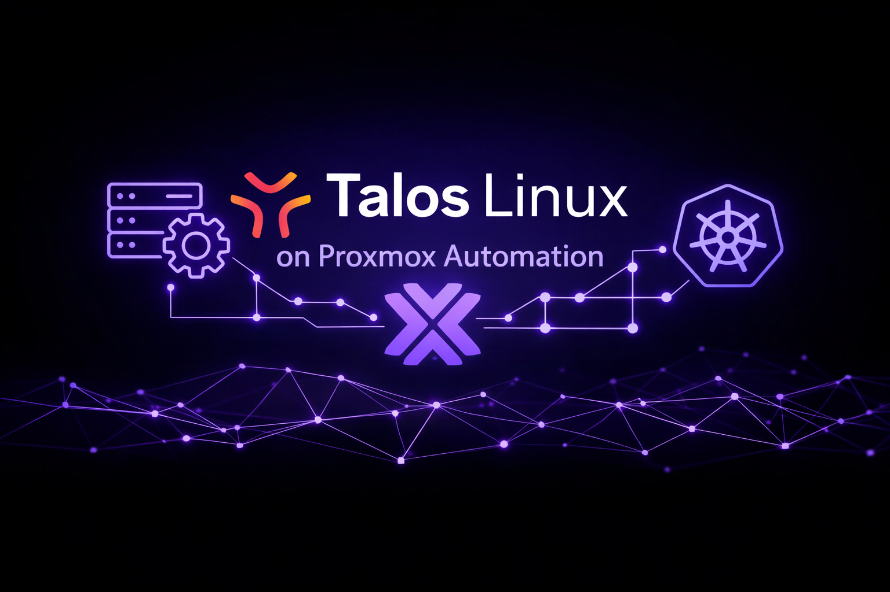
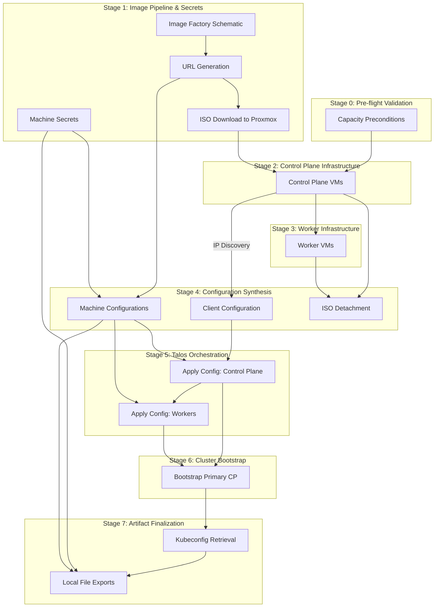

# Enterprise Talos on Proxmox Automation

This repository provides a production-grade Terraform-based framework for the automated deployment and lifecycle management of Talos Linux clusters on Proxmox Virtual Environment (VE). The solution is designed with enterprise requirements in mind, focusing on resource efficiency, predictable placement, and a fully automated "zero-touch" bootstrapping process.

## Architecture and Execution Lifecycle

This solution implements a strictly ordered dependency graph to ensure atomicity and reliability during the deployment of a Talos Linux cluster. The execution is divided into discrete stages, where each stage serves as a quality gate for the subsequent operations.

### Resource Dependency Graph

The following diagram illustrates the authoritative flow of information and execution order enforced by Terraform's directed acyclic graph (DAG).



### Detailed Execution Flow

#### 1. Pre-flight Validation (Stage 0)
The system performs deterministic resource accounting. Before any VM resource is touched, `terraform_data.capacity_assertions` validates:
- every placement target exists in `capacity_budget`
- aggregate and per-node requested vCPU/RAM fit the declared budget
- worker capacity still exists after control-plane placement

This prevents "half-baked" clusters that fail during provisioning.

#### 2. Artifact Preparation (Stage 1)
- **Secrets Generation**: Cluster-wide Talos machine secrets are generated by `talos_machine_secrets`.
- **Dynamic Image Building**: A schematic is submitted to Talos Image Factory from `talos.image_factory.extensions`. The resulting ISO is uploaded to each target Proxmox node using `talos.image_factory.storage` (default `local`).

#### 3. Proxmox Infrastructure Provisioning (Stages 2-3)
- **Control Plane First**: Control-plane VMs are provisioned first and wait for guest-agent-reported IPv4.
- **Sequential Worker Provisioning**: Worker VMs are created only after control planes (`depends_on = [proxmox_vm_qemu.control_plane]`).

#### 4. Post-Provisioning & Configuration Synthesis (Stage 4)
- **ISO Detachment**: Once VM IP is detected, `terraform_data.iso_detach` issues a Proxmox API `PUT` to set `ide2=none`.
- **Configuration Rendering**: The system renders `talosconfig`, `control-plane.yaml`, and `worker.yaml`. The cluster endpoint is either the configured VIP (`talos.control_plane_machine_config.vip.ip`) or the first control-plane IP.

#### 5. Talos Lifecycle Management (Stages 5-6)
- **Config Application**: Machine configurations are applied to the nodes via the Talos API. The system enforces that the control plane is configured before workers attempt to join.
- **Bootstrap**: A bootstrap signal is sent to the primary control plane node. This initiates etcd cluster formation and Kubernetes control plane initialization.

#### 6. Finalization (Stage 7)
- **Credential Export**: The system retrieves `kubeconfig` and writes generated artifacts to `dynamic/talos/`.
- **Operational Outputs**: Terraform emits `capacity_remaining_by_node`, `ip_by_control_plane`, `ip_by_worker`, and `talos_image_factory_urls`.

## Implementation Details

### Capacity-Aware Scheduling

The worker placement logic employs an interleaving algorithm to maximize cluster resilience and balance resource utilization:

1.  **Pre-calculation**: The system calculates the aggregate vCPU and Memory requirements for control plane nodes on a per-host basis.
2.  **Slot Allocation**: It determines the number of available "slots" for worker nodes on each physical host by dividing the residual capacity by the worker sizing profile.
3.  **Interleaved Distribution**: Available slots are sorted and interleaved (e.g., Host A - Slot 0, Host B - Slot 0, Host C - Slot 0, Host A - Slot 1...).
4.  **Dynamic Assignment**: Worker nodes are assigned to these interleaved slots sequentially. This ensures that workers are spread as widely as possible across the physical infrastructure, even if some nodes have significantly more capacity than others.

### Automated ISO Detachment

To maintain a clean boot environment and prevent unintended re-installations, the solution automates the removal of the Talos installation media:

- **Mechanism**: A `terraform_data` resource monitors the state of all VM instances.
- **Dependency**: The process is triggered only after the Proxmox provider successfully reports the VM's dynamic IP address, which serves as a proxy for the Guest Agent's readiness.
- **Action**: A `PUT` request is dispatched to the Proxmox API to set the `ide2` CD-ROM drive to `none`.
- **Persistence**: The VM resources use `lifecycle { ignore_changes = [disk] }` to ensure that subsequent Terraform operations do not attempt to revert the ISO detachment.

## Configuration Variables

The following variables are defined in `dynamic/config.tf` and `dynamic/providers.tf`.

### Provider Authentication

These variables are required for authenticating with the Proxmox API. It is recommended to provide these via a `.tfvars` file or environment variables.

| Variable | Type | Sensitive | Description |
| :--- | :--- | :--- | :--- |
| `proxmox_api_url` | `string` | No | The full URL of the Proxmox API (e.g., `https://pve.example.com:8006/api2/json`). |
| `proxmox_api_token_id` | `string` | Yes | Proxmox API Token ID (e.g., `terraform@pam!mytoken`). |
| `proxmox_api_token_secret` | `string` | Yes | Proxmox API Token secret. |

### Cluster Intent

| Variable | Type | Default | Description | Constraints / Validation |
| :--- | :--- | :--- | :--- | :--- |
| `cluster_identity` | `object({ name = string })` | - | Cluster identity for VM names, tags, and Talos cluster name. | `name` must be lowercase/digits/hyphen and length >= 3 |
| `cluster_topology` | `object` | `control_plane=3(ha), worker=2` | Control-plane and worker replica intent. | `ha` requires odd CP count >= 3; `single` requires CP >= 1; CP <= 7; workers >= 0 |

### Proxmox Platform Contract

| Variable | Type | Default | Description |
| :--- | :--- | :--- | :--- |
| `proxmox_platform.placement_targets.hostnames` | `list(string)` | - | Allowed Proxmox hosts for placement. |
| `proxmox_platform.storage.datastore_id` | `string` | - | Datastore used for VM system disks (`scsi0`). |
| `proxmox_platform.network.bridge` | `string` | - | Bridge name (for example `vmbr0`). |
| `proxmox_platform.network.vlan_id` | `number (optional)` | `null` | Optional VLAN tag for VM NICs. |

### Capacity and Placement Policy

| Variable | Type | Default | Description | Constraints / Validation |
| :--- | :--- | :--- | :--- | :--- |
| `capacity_budget` | `map(object({vcpu, memory}))` | - | Per-host vCPU/RAM budget used as authoritative admission control. | Must not be empty; every placement target must exist |
| `infrastructure_policy.node_distribution_strategy` | `string` | `"spread"` | Placement mode: `spread`, `round_robin`, `pin`. | Must be one of the 3 allowed values |
| `infrastructure_policy.host_affinity` | `map(list(string))` | `{}` | VM-to-host pinning map when strategy is `pin`. | Optional |

**Pinned Placement Example:**

```hcl
infrastructure_policy = {
  node_distribution_strategy = "pin"
  host_affinity = {
    pve1 = ["talos-lab-cp-01", "talos-lab-wk-01"]
    pve2 = ["talos-lab-cp-02"]
    pve3 = ["talos-lab-cp-03", "talos-lab-wk-02"]
  }
}
```

### Node Sizing Policy

| Variable | Type | Default | Description | Constraints / Validation |
| :--- | :--- | :--- | :--- | :--- |
| `node_profiles.control_plane` | `object({vcpu,memory,disk})` | `{2,4096,40}` | Sizing policy for control-plane nodes. | Minimum `2 vCPU`, `2048 MB`, `20 GB` |
| `node_profiles.worker` | `object({vcpu,memory,disk})` | `{2,4096,40}` | Sizing policy for worker nodes. | Minimum `1 vCPU`, `1024 MB`, `20 GB` |

### Talos Configuration Contract

| Variable / Attribute | Type | Default | Description |
| :--- | :--- | :--- | :--- |
| `talos.image_factory.version` | `string` | `v1.9.4` | Talos version used for image factory URL resolution. |
| `talos.image_factory.arch` | `string` | `amd64` | Target architecture. |
| `talos.image_factory.platform` | `string` | `metal` | Target platform for image factory. |
| `talos.image_factory.storage` | `string` | `local` | Proxmox storage used for uploaded ISO. |
| `talos.image_factory.extensions` | `list(string)` | `[]` | System extensions baked into installer image. |
| `talos.control_plane_machine_config.extra_manifests` | `list(string)` | `[]` | Remote manifests applied post-bootstrap by Talos. |
| `talos.control_plane_machine_config.inline_manifests` | `list(object)` | `[]` | Inline/templated manifests rendered from local files. |
| `talos.control_plane_machine_config.vip` | `object (optional)` | `null` | Optional VIP endpoint for control plane API. |
| `talos.extra_machine_configuration` | `any` | `{}` | Extra machine config patch merged into install profile. |

## Operational Guide

### 1. Preparation

No manual ISO upload is required. A Talos Image Factory schematic is generated from `talos.image_factory.extensions`, and the resulting ISO is uploaded to each Proxmox node in `proxmox_platform.placement_targets.hostnames`.

- Ensure the Proxmox Guest Agent extension (`siderolabs/qemu-guest-agent`) is included in `talos.image_factory.extensions`.
- Ensure `talos.image_factory.storage` exists and is ISO-capable on every target host.
- If using a VIP, ensure `talos.control_plane_machine_config.vip.ip` is routable from operators and cluster nodes.

### 2. Authentication

Configure provider credentials in `dynamic/credentials.auto.tfvars`:

```hcl
proxmox_api_url          = "https://<pve-host>:8006/api2/json"
proxmox_api_token_id     = "terraform-user@pam!tokenid"
proxmox_api_token_secret = "uuid-secret"
```

### 3. Deployment

Initialize the Terraform environment and execute the orchestrated deployment:

```bash
cd dynamic/
terraform init
terraform plan
terraform apply
```

**What to expect during `apply`:**
1.  **Admission Control**: `capacity_assertions` validates global and per-node capacity before VM provisioning.
2.  **Image Distribution**: `proxmox_storage_iso.talos` uploads the generated Talos ISO to every target Proxmox node.
3.  **VM Provisioning**: Control-plane VMs are created first, then workers.
4.  **Day-0 Clean-up**: `terraform_data.iso_detach` removes the installation ISO (`ide2=none`) after IP discovery.
5.  **Talos Orchestration**: Machine configs are applied to control planes first, then workers.
6.  **Bootstrap + Access**: Cluster bootstrap is triggered on the first control-plane node, then `kubeconfig` is retrieved.

### 4. Cluster Access

Upon completion, access artifacts are stored in `dynamic/talos/`:

- `talosconfig`: Client configuration for `talosctl`.
- `kubeconfig`: Standard Kubernetes configuration for `kubectl`.
- `control-plane.yaml` / `worker.yaml`: Generated machine configurations.
- `secrets.yaml`: Cluster secrets bundle.

Terraform also exposes runtime outputs:
- `capacity_remaining_by_node`
- `ip_by_control_plane`
- `ip_by_worker`
- `talos_image_factory_urls`

### 5. Known Configuration Caveat

The current sample `dynamic/terraform.tfvars` contains `strorage` under `talos.image_factory`.
Use `storage` (correct key) in real environments.

## Production Hardening Roadmap

While this solution provides a robust foundation, the following enhancements are recommended for enterprise production environments:

1.  **Remote State Management**: Migrate to a secure remote backend (e.g., S3 with DynamoDB, Terraform Cloud) to ensure state durability and support multi-user workflows.
2.  **Centralized Secret Storage**: Integrate with an enterprise secret manager (e.g., HashiCorp Vault) to remove sensitive credentials from local files.
3.  **Static IP and Load Balancing**: Implement static IP addressing for control plane nodes or deploy a Virtual IP (VIP) solution to ensure a stable and resilient API server endpoint.
4.  **Network Hardening**: Apply granular firewall rules at the Proxmox host level and implement Kubernetes Network Policies to restrict traffic to the management and API ports.
5.  **Observability Integration**: Export Talos and Kubernetes logs/metrics to an enterprise monitoring stack (e.g., ELK, Prometheus/Grafana) for proactive incident management.
6.  **Policy-as-Code Enforcement**: Add mandatory policy checks (for example OPA/Conftest/Sentinel) for topology, sizing, and network controls.
7.  **Disaster Recovery**: Establish a backup policy using Proxmox Backup Server and implement automated etcd snapshotting.

## Current CI/CD Controls

The repository already includes a pull-request workflow at `.github/workflows/pr.yaml` with enterprise baseline checks:

1.  **Terraform Quality Gate**: `terraform fmt -check`, `terraform init -backend=false`, and `terraform validate` (working directory `dynamic/`).
2.  **Linting Gate**: `tflint --init` and `tflint -f compact`.
3.  **Security Gate**: `tfsec` SARIF generation and upload to GitHub Code Scanning.
4.  **Review UX Gate**: Automated upserted PR comment with job result badges and captured command outputs.
5.  **Execution Discipline**: Concurrency control and non-draft PR enforcement.

## Add-ons and Image Pipeline

### Talos Image Factory Integration
- A schematic is generated from `talos.image_factory.extensions` and submitted to the Talos Image Factory.
- The produced ISO is uploaded automatically to each target Proxmox node.
- Machine configurations set `machine.install.image` to the matching installer image URL, ensuring nodes install the exact image built by the schematic.

### Kubernetes Add-ons Installation
- Inline manifests from `talos.control_plane_machine_config.inline_manifests` are rendered from local files and injected into cluster bootstrap config.
- The current repository template is `dynamic/cluster-manifests/argocd-root-app.yaml.tftpl`, which renders an Argo CD repository secret and root application.
- Remote YAMLs in `talos.control_plane_machine_config.extra_manifests` are fetched and applied automatically by Talos post-bootstrap.

### Longhorn Support
- `talos.extra_machine_configuration.kubelet.extraMounts` can preconfigure `/var/lib/longhorn` mounts on nodes to support Longhorn volume operations.

## Requirements
- Terraform >= 1.14.5
- Providers:
  - telmate/proxmox `3.0.2-rc07`
  - siderolabs/talos `0.10.1`
  - hashicorp/local `2.5.2`
